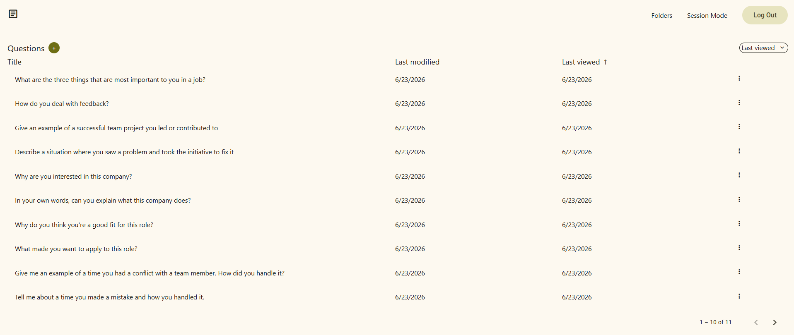
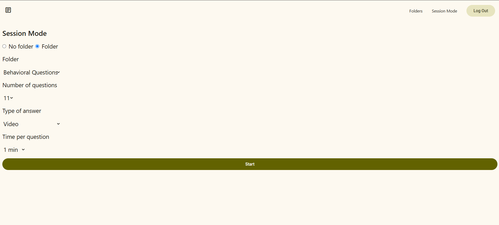
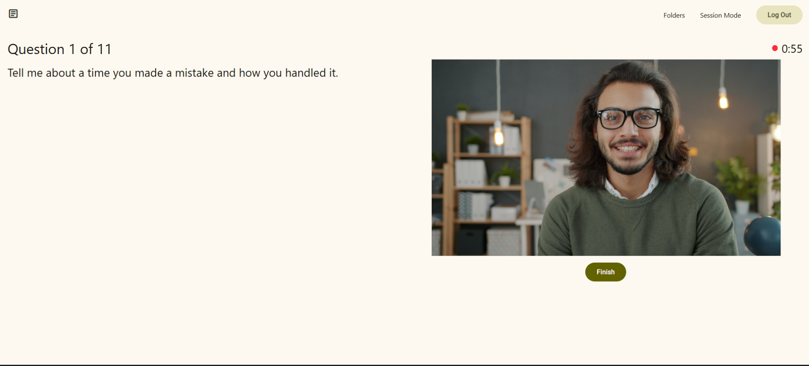

# Interview Docs

Interview Docs is a website where you can practice interview questions.  

Start here: https://www.interviewdocs.net



## Why Interview Docs?

- Add interview questions along with your personalized answers via text or video.
- Create folders to organize questions based on question type, job roles, and companies.
- Simulate virtual interviews by using Session Mode

## Getting started

### Prerequisites

- npm
```
npm install npm@latest -g
```
- [Java 25+](https://www.oracle.com/java/technologies/downloads/)

- [An AWS account](https://aws.amazon.com/)
  - Create an S3 bucket where your videos will be stored
  - Create a CloudFront distribution and set its origins to the S3 bucket
    1. Create a public key
      ```
      openssl genrsa -traditional -out private_key.pem 2048
      ```
    2. Create a private key
      ```
      openssl rsa -pubout -in private_key.pem -out public_key.pem
      ```
    3. Add public key and create a key group in CloudFront Key Management
    4. In the behaviors section of the distribution, create a behavior and do the following:
       1. Set Restrict viewer actions to Yes
       2. Set Trusted authorization type to Trusted key groups (recommended)
       3. Add your key group 
    
- [An Auth0 Regular Web Application](https://auth0.com/)
  - In Application URIs:
    - In Allowed Callback URLs, set the following:
      - http://localhost:8080/oauth/callback/auth0
    - In Allowed Logout URLs, set the following:
      - http://localhost:4200
    - In Allowed Web Origins, set the following:
      - http://localhost:4200
      - http://localhost:8080
    - In Allowed Origins (CORS), set the following:
      - http://localhost:4200
      - http://localhost:8080

## Installation
1. Clone the repo
```
git clone git@github.com:JB012/interview-docs.git
```

3. Enter credentials in client/.env.example and server/.env.example
```
NG_APP_AWS_SECRET_ACCESS_KEY=YOUR_AWS_SECRET_ACCESS_KEY

DB_HOST=YOUR_DB_HOST
```

4. Create .env
```
cd client
cp .env.example .env
```
```
cd server
cp .env.example .env
```

5. Install client dependencies
```
cd client
npm install
```

6. Run the client and server
```
cd client
npm start
```
```
cd server
./gradlew run "-Dmicronaut.environments=dev"
```
## Features

### Session Mode

Answer a custom amount of interview questions of your choice under a custom time. 

 


## Built With
- Angular
- TypeScript
- Java
- Micronaut
- PostgreSQL
